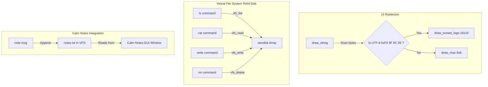

# Sunset OS — Implementation Plan: Milestone 9 (Emoji Logo & Virtual File System RAM Disk)


We will implement **Milestone 9 (High-fidelity Emoji Logo & VFS RAM Disk)** for **Sunset OS (Ghuroob OS)**. This phase focuses on resolving the out-of-bounds glyph rendering bug that draws `????` for the sunset emoji (`🌅`), replacing it with a custom 16x16 pixel-art setting sun logo, and implementing an in-memory Virtual File System (VFS) RAM disk with shell commands and dynamic Calm Notes integration.

---

## User Review Required

Please review the proposed architectural and low-level designs for Milestone 9:
> [!IMPORTANT]
> - **UTF-8 Emoji Interception**: The standard 8x8 font system converts characters outside 32-127 into `?`. We will detect the four-byte UTF-8 sequence for `🌅` (`0xF0 0x9F 0x8C 0x85`) inside `draw_string` and draw a custom, high-fidelity 16x16 pixel-art sunset logo, slightly raised to align with the text baseline.
> - **In-Memory RAM Disk (VFS)**: We will create a light Virtual File System (VFS) using an active file slot array structure inside high-memory workspace, supporting creating, listing, reading, writing, and deleting files.
> - **Shell Command Extraction Fix**: The existing terminal extracts commands starting from index 32, which breaks scrollback and multi-command history because the prompt keeps appending. We will fix this by searching backwards to extract the command relative to the *last* active prompt in the buffer.
> - **Calm Notes & VFS Binding**: Instead of utilizing an isolated global char buffer, the "Calm Notes" window will read directly from a VFS file (`notes.txt`). The shell command `note [msg]` will dynamically append to `notes.txt` in the VFS, automatically updating the GUI window in real time!

---

## Proposed Changes

We will group our proposed changes by the VFS core and the graphics rasterizer.



---

### Component 1: Custom Pixel-Art Sunset Emoji Rendering

We will implement the pixel-art logo rendering and string matching inside the graphics module.

#### [MODIFY] [font.c](file:///d:/sunset-OS/kernel/graphics/font.c)
* Implement `draw_sunset_logo(int x, int y)`:
  - Draws a gorgeous 16x16 custom pixel-art sunset card.
  - The sky background remains transparent to blend perfectly with title bars and gradient backdrops.
  - The setting sun is a half-circle dome colored with a brilliant light-yellow core (`255, 240, 150`) and golden-orange mantle (`253, 150, 30`).
  - The sea body below has light gold/orange wave reflections in the center and deep purple-blue wave highlights.
* Update `draw_string` to intercept UTF-8 bytes:
  - Cast `str[i]` to `unsigned char` to prevent signed comparison conflicts.
  - Check if `c == 0xF0 && (unsigned char)str[i+1] == 0x9F && (unsigned char)str[i+2] == 0x8C && (unsigned char)str[i+3] == 0x85`.
  - If matched, invoke `draw_sunset_logo(curr_x, curr_y - 4)` (raised 4px to align vertically with the 8x8 font), advance `curr_x += 16` (logo width), and skip the remainder of the UTF-8 sequence using `i += 3`.

---

### Component 2: Virtual File System (VFS) and RAM Disk

We will implement a lightweight, static RAM disk under the core kernel workspace.

#### [NEW] [vfs.h](file:///d:/sunset-OS/kernel/core/vfs.h)
* Define file structure and API function signatures:
```c
#ifndef VFS_H
#define VFS_H

#define MAX_VFS_FILES 8
#define MAX_FILE_NAME 32
#define MAX_FILE_SIZE 512

typedef struct {
    char name[MAX_FILE_NAME];
    char content[MAX_FILE_SIZE];
    int size;
    char active;
} vfs_file_t;

extern vfs_file_t ramdisk[MAX_VFS_FILES];

void vfs_init();
int vfs_list(char* out, int max_len);
int vfs_read(const char* name, char* out, int max_len);
int vfs_write(const char* name, const char* content);
int vfs_delete(const char* name);

#endif
```

#### [NEW] [vfs.c](file:///d:/sunset-OS/kernel/core/vfs.c)
* Implement RAM disk memory allocation:
  - Create the `ramdisk` global array.
  - Implement static helper string handlers (`strcmp`, `strcpy`, `strlen`) to maintain freestanding safety.
  - Implement `vfs_init()` which pre-allocates default files:
    - `welcome.txt` (Tranquil welcome banner text).
    - `philosophy.txt` (Sunset OS naming philosophy text).
    - `todo.txt` (Calming mindfulness checklist).
  - Implement `vfs_list()`, formatting files as a readable list (e.g. `- welcome.txt (112 bytes)\n`).
  - Implement `vfs_read()`, `vfs_write()`, and `vfs_delete()`.

---

### Component 3: Shell and GUI Window Integrations

We will update the shell parser and GUI variables inside the main coordinator.

#### [MODIFY] [kernel.c](file:///d:/sunset-OS/kernel/core/kernel.c)
* Include `#include "vfs.h"` at the top of the file.
* Initialize the VFS by calling `vfs_init();` immediately after graphics drivers inside `kernel_main`.
* Bind the "Calm Notes" window to `notes.txt` in the VFS:
  - In `kernel_main`, create and write initial calming content to `notes.txt` in VFS.
  - Initialize the window with content pointed directly to the VFS content buffer: `init_window(&win_notes, 440, 70, 320, 210, "Calm Notes", ramdisk[notes_slot].content)`.
* Fix command extraction from `shell_buffer`:
  - Replace index-32 hardcoded extraction.
  - Scan backwards to find the last occurrence of `"sunset-OS:~$ "` in `shell_buffer`.
  - Extract the command starting immediately after that prompt index, cleanly supporting multi-command shell execution without conflict or `clear` dependency.
* Add shell commands:
  - `ls`: List files in the RAM disk.
  - `cat [filename]`: Print file content.
  - `touch [filename]`: Create an empty file.
  - `write [filename] [content]`: Overwrite/create a file with the written string.
  - `rm [filename]`: Delete a file.
* Update `note [msg]` command:
  - Read existing contents of `notes.txt` from the VFS.
  - Append the new note drift string.
  - Write it back using `vfs_write("notes.txt", ...)`, which automatically triggers in-memory buffer sync and GUI redraws instantly!

---

### Component 4: Build System Toolchain Integration

We will register the new C module inside the PowerShell automation script.

#### [MODIFY] [build.ps1](file:///d:/sunset-OS/tools/build.ps1)
* Add `vfs` into the modules mapping:
```powershell
    'vfs'       = 'kernel/core/vfs.c'
```
* Append `vfs` inside the compilation and link sequencing array:
```powershell
$moduleOrder = @('memory', 'graphics', 'font', 'vfs', 'window', 'garden', 'mouse', 'sound', 'net', 'idt', 'scheduler', 'kernel')
```

---

## Verification Plan

### Automated / Compiler Tests
1. **Compilation Check**: Run `powershell.exe -ExecutionPolicy Bypass -File tools/build.ps1` to ensure NASM, GCC, and LD link `vfs.o` and compile successfully.

### Manual / Visual Verification inside QEMU
1. **Sunset Logo Verification**:
   - Verify the boot card loads the gorgeous pixel-art Sun and ocean reflections without any question marks.
   - Verify the taskbar at the bottom left renders `🌅 Sunset OS v0.4` correctly and cleanly aligned.
2. **Multi-Command Execution Validation**:
   - Type multiple sequential commands: `help`, `chime`, `lofi 1` without typing `clear` and verify they all execute properly (proving prompt extraction fix works).
3. **VFS File Shell Command Validation**:
   - Type `ls` to verify the pre-allocated files list shows up.
   - Type `cat welcome.txt` to print the greeting message.
   - Type `touch deep.txt` and verify `ls` lists `deep.txt (0 bytes)`.
   - Type `write deep.txt Take a deep breath.` and verify `cat deep.txt` shows the text.
   - Type `rm deep.txt` and verify it is removed from `ls`.
4. **Calm Notes Live Sync**:
   - Type `note Relax your shoulders.` in the terminal.
   - Verify that the Calm Notes GUI window instantly displays the appended note!
