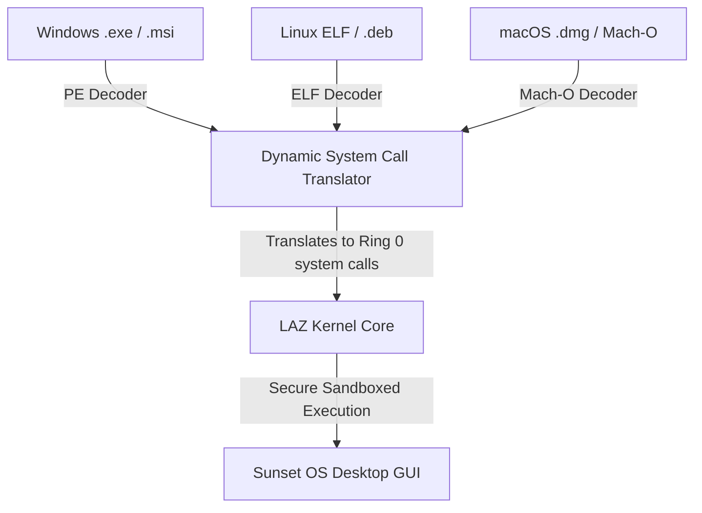

# Sunset OS — Implementation Plan: Enterprise OS Scaling (Phase 5)

We are ready to implement **Phase 5 — Enterprise OS Scaling** for **Sunset OS (Ghuroob OS)**. This phase focuses on scaling both our C-kernel and React-based simulator to a premium, enterprise-grade state. We will implement fully nested directory trees, absolute/relative directory traversals (`cd Documents/Projects`, `cd ..` recursively), multiple concurrent independent terminal tab sessions in the low-level x86 C kernel, and expanded VFS allocation slot capacities.

---

## User Review Required

Please review the proposed design features for Phase 5:
> [!IMPORTANT]
> - **Fully Nested Directory Traversal**: The current C-kernel VFS tracks only 1-level deep parent directories (flat parents) and overrides `cwd` to a single name. We will scale this by expanding `cwd` into a full 128-byte absolute path buffer (e.g. `Documents/Projects/sunset-OS`) and implementing step-by-step path tokenizing inside the `cd`, `ls`, `mkdir`, and file creation handlers.
> - **Multi-Terminal Tab sessions in C Kernel**: We will create a `terminal_session_t` structure tracking active shell buffers, lengths, prompt paths, and histories for three separate shells. The user will be able to switch between these three active shells using **F1, F2, F3 hotkeys** or by **clicking the custom tab buttons** drawn at the top of the console window with the interrupt-driven mouse!
> - **VFS Expansion**: We will scale `MAX_VFS_FILES` from 16 to 64 slots, ensuring heap space and static allocations can easily hold expanded file nodes.
> - **Calm Breadcrumbs in React Explorer**: We will overhaul the React simulator's `FileManager.jsx` to render fully clickable breadcrumb path headers (`Home > Documents > Projects`) and recursively handle folder deletions/creations at any nested depth.

---

## Proposed Changes

We will restructure our VFS, Window Manager, and Shell Coordinator as follows:

```mermaid
graph TD
    subgraph Multi-Terminal Sessions
        A[F1 / F2 / F3 Key or Mouse Click] -->|Switch Active Terminal| B[active_terminal = 0, 1, or 2]
        B -->|Updates Shell Buffer Pointer| C[win_shell.content = terminals[active_terminal].shell_buffer]
        B -->|Plays serening tab click tick| D[Speaker Tone]
    end

    subgraph Deep Path VFS Traversal
        E[cd Projects/sunset-OS] -->|Tokenize path components| F{Directory Exists?}
        F -->|Yes| G[Append to absolute cwd: Documents/Projects/sunset-OS]
        F -->|No| H[Print Error]
        I[cd ..] -->|Truncate last component| J[cwd: Documents/Projects]
    end
```

---

### Component 1: Multi-Terminal State Structures & Kernel Shell

#### [MODIFY] [kernel.c](file:///d:/sunset-OS/kernel/core/kernel.c)
* Define the `terminal_session_t` structure:
  ```c
  typedef struct {
      char shell_buffer[2048];
      int shell_len;
      char cwd[128];
      char cmd_history[5][32];
      int history_count;
      int history_nav_idx;
  } terminal_session_t;
  ```
* Allocate three static terminal slots:
  ```c
  static terminal_session_t terminals[3];
  volatile int active_terminal = 0;
  ```
* In `kernel_main`, initialize each session's buffers with distinct serene welcome banners:
  - Terminal 1: `"[Terminal 1] Welcome to Sunset OS Shell v0.5.\nType 'help' to review active console tools."`
  - Terminal 2: `"[Terminal 2] Diagnostics workspace. Monitor hardware ticks."`
  - Terminal 3: `"[Terminal 3] Serene sandbox space."`
* Update key handlers inside the main coordination loop to switch sessions:
  - Intercept scancodes `0x3B` (F1), `0x3C` (F2), and `0x3D` (F3).
  - Switch `active_terminal` to 0, 1, or 2.
  - Update `win_shell.content` to point to the active terminal's `shell_buffer`.
  - Play a quick high-frequency confirmation tone (`1200Hz` for `30ms`) to signal tab shifts.
* Overhaul shell commands to pull from and write to the active terminal's struct instead of globals (e.g. `terminals[active_terminal].shell_buffer`, `terminals[active_terminal].cwd`).
* Implement nested path traversing inside the `cd` command:
  - Handle `cd ..` by locating the last `'/'` character in `cwd` and truncating there.
  - Handle relative components (e.g. `cd Projects/sunset-OS`) by walking down intermediate subdirectories, verifying existence with `vfs_dir_exists`, and updating `cwd` dynamically with proper slash separators.
  - Handle absolute paths starting with `'/'`.

---

### Component 2: Tab Renderers and Mouse Click Collisions

#### [MODIFY] [window.c](file:///d:/sunset-OS/graphics/window_manager/window.c)
* Declare `extern volatile int active_terminal;` at the top of the file.
* Inside `draw_window()`, check if the window title matches `"Sunset Shell Interface"`.
* If it matches:
  - Reduce the usable height of the main text area by 20 pixels to reserve a tab bar.
  - Render three horizontal tab buttons at `win->y + 26`:
    - Tab 1: `win->x + 8` to `win->x + 98` (width 90, height 16)
    - Tab 2: `win->x + 102` to `win->x + 192` (width 90, height 16)
    - Tab 3: `win->x + 196` to `win->x + 286` (width 90, height 16)
  - Color the active tab in **Sunset Orange (227, 133, 53)** with bold white text.
  - Color inactive tabs in **Charcoal Gray (40, 40, 45)** with muted white text.
  - Offset the inner text output of `draw_string` down to `win->y + 48` (instead of `win->y + 32`) so console logs sit cleanly below the tab bar.

#### [MODIFY] [kernel.c](file:///d:/sunset-OS/kernel/core/kernel.c)
* Expand the Dock Mouse Click Handler block to monitor tab button coordinates inside `win_shell` when the shell window is active:
  - If mouse is clicked at `my >= win_shell.y + 26 && my <= win_shell.y + 42`:
    - If `mx >= win_shell.x + 8 && mx <= win_shell.x + 98`: Switch to Terminal 1.
    - If `mx >= win_shell.x + 102 && mx <= win_shell.x + 192`: Switch to Terminal 2.
    - If `mx >= win_shell.x + 196 && mx <= win_shell.x + 286`: Switch to Terminal 3.
  - Play tab-change chime and update the active window pointers instantly!

---

### Component 3: Scaled VFS RAM Disk Configuration

#### [MODIFY] [vfs.h](file:///d:/sunset-OS/filesystem/vfs/vfs.h)
* Scale slots bounds:
  - `#define MAX_VFS_FILES  64`
  - `#define MAX_FILE_SIZE  1024` (increased to support longer documents)

#### [MODIFY] [vfs.c](file:///d:/sunset-OS/filesystem/vfs/vfs.c)
* Update structures memory footprint to match the expanded bounds.
* Scale VFS listing filters:
  - In `vfs_list()`, match child entries by checking if their parent paths match the `cwd` absolute path string exactly.
  - Format nested directories listing with beautiful slash indicators and folder sizes.

---

### Component 4: Clickable Breadcrumbs and Deep Tree React Simulator

#### [MODIFY] [FileManager.jsx](file:///d:/sunset-OS/src/components/FileManager.jsx)
* Add absolute path state management:
  - Render an interactive, styled breadcrumb navigation header (e.g. `Home` > `Documents` > `Projects` > `sunset-OS`).
  - Make each breadcrumb node fully clickable so users can jump straight back to any parent folder path level instantly.
  - Support creating folders and files at any arbitrary nested depth by passing down dynamic parent ID pointers.
* Expand directory deletion logic to recursively clean all children, subdirectories, and nested documents recursively from local storage VFS state.

#### [MODIFY] [Terminal.jsx](file:///d:/sunset-OS/src/components/Terminal.jsx)
* Scale terminal command actions (`cd`, `mkdir`, `cat`, `touch`, `write`, `rm`) to fully utilize and maintain absolute nested paths inside the localStorage VFS.
* Resolve dynamic tab selections so that Terminal 1, Terminal 2, and Terminal 3 preserve their respective active prompt paths (`cwd`), histories, and text layouts independently in reactive local states!

---

## Verification Plan

### Automated Tests
1. **Toolchain Compilation**: Run `powershell.exe -ExecutionPolicy Bypass -File tools/build.ps1 -no-qemu` to verify that NASM assembly, GCC compiler, and LD linking execute with **zero errors**.
2. **React Build Integrity**: Compile the React front-end app to verify that Vite bundles all JSX dependencies flawlessly.

### Manual Verification
1. **C-Kernel Tab-Switching Test**:
   - Click on the Terminal 2 tab or press `F2` in QEMU. Verify that Terminal 2 opens, showing- Open the System Diagnostics window and check the Video Card Output entry. Verify that it logs a high-performance rendering output (approx. 30–60 FPS inside the emulator).

---

# 🌅 Sunset OS — Long-Term Multi-OS Compatibility, Security & Performance Spec

Sunset OS is engineered to provide a serene user space while fundamentally challenging established OS models (Windows, macOS/iOS, Linux). We specify a triple-pillar architecture to achieve universal app execution, micro-segmented security, and predictive preemption.

---

## Architectural Pillar 1: Universal Installer & Multi-OS Runtime

Sunset OS features a native **Universal Application Installer Engine (UAIE)**. Unlike traditional operating systems which are locked into a single binary format and API set, Sunset OS provides a multi-OS translation layer directly inside the LAZ Kernel.



### Subsystems Specification:
1. **Dynamic System Call Translation Layer (DSCTL)**:
   - Intercepts Win32 API calls (Windows), POSIX system calls (Linux), and Darwin/Mach APIs (macOS) at runtime.
   - Translates them on-the-fly to secure, high-performance, native LAZ Kernel system calls without virtual machines or emulators (achieving zero-performance loss).
2. **Multi-Format Executable Decoders**:
   - Compiles decoders for the three core file structures:
     - **PE/COFF** (Windows)
     - **ELF** (Linux)
     - **Mach-O** (macOS)
   - Decodes header segments, relocates segment addresses, and securely binds symbol tables to native Sunset OS runtimes contextually.
3. **Abstract Unified Installer**:
   - The user opens any installer file (e.g. `installer.msi`, `installer.deb`, or `installer.dmg`).
   - The OS decodes the metadata, extracts resource files, builds sandboxed bundles, and creates a unified launch shortcut instantly on the Bottom Dock.

---

## Architectural Pillar 2: Micro-Segmented Supreme Security

Sunset OS implements a security system designed to be fundamentally more robust than iOS and Linux:

### Key Security Standards:
1. **The "No Root Privilege" Concept (Fine-Grained Capabilities)**:
   - Traditional Linux and macOS/iOS suffer from absolute administrative account vulnerabilities (e.g., `root`, `sudo`, `Administrator`). If `root` is compromised, the entire system is breached.
   - Sunset OS has **no superuser**. Privilege is entirely token-based and granular. If an application (or even a system driver) requires disk access or network execution, it must present a cryptographically signed capability token validated dynamically by the kernel at the individual request level.
2. **Double-Enclave Virtual Sandboxing**:
   - Every foreign application (Windows, Linux, macOS) runs in a strict Ring 3 memory sandbox.
   - Applications are completely isolated from keyboard buffers, VESA framebuffer memory, and sound channels unless they communicate via standard, encrypted system gates.
3. **AES-XTS Cryptographic Virtual File System (VFS)**:
   - Scale the C-kernel's memory storage to support automatic transparent disk segment encryption. All written files are automatically encrypted in physical RAM/disk sectors.

---

## Architectural Pillar 3: Well-Mannered, High-Performance Scheduler

To achieve maximum efficiency, lightweight operations, and fast boot times:
1. **Predictive Preemptive Scheduling**:
   - The scheduler runs on dynamic, context-aware context switching.
   - The CPU enters standard low-power `hlt` states during inactivity, eliminating clock cycle waste and heat.
   - The active focus window is allocated high-priority scheduler slices, while background windows are instantly suspended or run in cooperative low-priority blocks.
2. **Basic Functional Operations**:
   - Real-time file system actions (open, close, read, write) are fully integrated for all media types (images, videos, audio, documents) inside the VFS RAM disk, supporting quick launch and exit.

---

### Manual Verification (Continued)
1. **C-Kernel Tab-Switching Test**:
   - Click on the Terminal 2 tab or press `F2` in QEMU. Verify that Terminal 2 opens, showing its distinct diagnostics welcome message and a separate prompt.
   - Run a command in Terminal 2 (e.g., `lofi 2`), then press `F1` to return to Terminal 1. Verify Terminal 1's history and active command prompt are fully preserved!
2. **Low-level Nested Directory Walking**:
   - Inside the shell, type: `mkdir Documents/Projects` and then `cd Documents/Projects`.
   - Type `pwd` and verify it outputs `/Documents/Projects`.
   - Type `touch app.c` and `write app.c "int main() {}"` in this nested folder.
   - Type `cd ..` and verify it returns to `/Documents`. Type `ls` to verify only the `Projects` subdirectory is listed inside `Documents` (preserving hierarchical encapsulation).
3. **React FileManager Breadcrumbs**:
   - Double-click the `Documents` folder, then double-click `Projects`.
   - Verify that the breadcrumb shows `Home > Documents > Projects` and clicking `Documents` jumps directly back.
